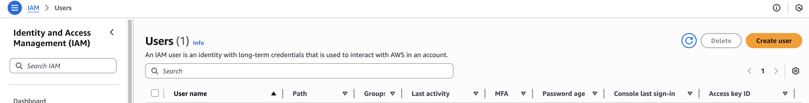
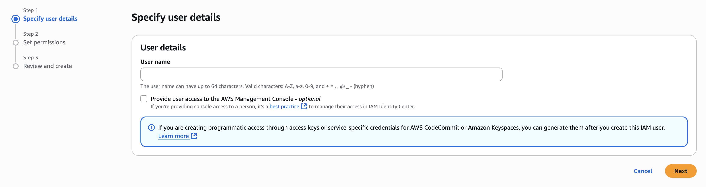
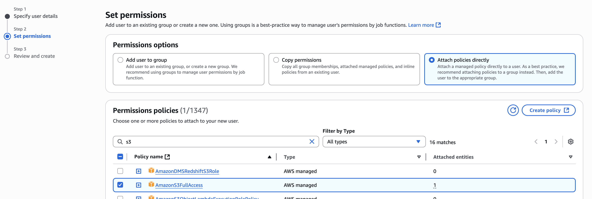

### Installation

1. Create a new conda environment with the required packages:
```bash
conda create -n ox -c conda-forge --strict-channel-priority osmnx tqdm boto3 python-dotenv
``` 
2. Make sure you have set the environment variables for AWS credentials in a `.env` file:
```
AWS_ACCESS_KEY_ID=your_access_key_id
AWS_SECRET_ACCESS_KEY=your_secret_access_key
AWS_DEFAULT_REGION=your_default_region
AWS_S3_BUCKET=your_s3_bucket
```
To create an an identity:
1. Go to the AWS IAM (Identity and Access Management) console and create a new user.

2. Create a new user named `osmnx-user` with programmatic access.

3. Attach the `AmazonS3FullAccess` policy to the user.

4. Click next and create the user.

5. Click on the user.

6. In summary section, `Create access key`

7. Select Local code.  Provide description.  Then click `Create access key`
8. Copy the access key and secret key.  Save them in a `.env` file in the root directory of your project.


Please send your canonical user ID to me so I can add you to the S3 bucket.  You can find your canonical user ID by following these steps:
1. Click on your username which is located in the top menu bar.
2. A drop down will appear. Select My Security Credentials.
3. Canonical user ID is there